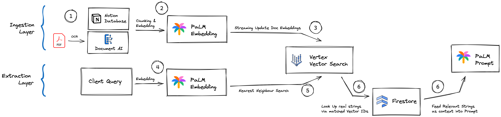

# Retrieval Augmented Agent

This is an implementation of the Retrieval Augmented Generation (RAG) pattern to power a Q&A across mutliple knowlegde management platform.

Currently we are connecting a bucket of PDFs and a Notion DB as knowledge base to answer questions on.

Expected behaviour will be that the model responds to questions exclusively based on the data contained in the knowlegde base.

## Architecture RAG Q&A
The full tooling is using Google Cloud Platform (GCP) Native Tech.

* Document OCR: [Document AI](https://cloud.google.com/document-ai/docs/overview)
* Generation of Content & User Query embeddings: [PaLM Embedding Model](https://cloud.google.com/vertex-ai/docs/generative-ai/embeddings/get-text-embeddings)
* Storing and making vector embeddings searchable: [Vertex Vector Search](https://cloud.google.com/vertex-ai/docs/vector-search/overview)
* Ledger connecting embeddings to original content strings: [Firestore](https://firebase.google.com/docs/firestore)
* generating a conversational response to the users original question based on the content identified as relevant: [PaLM text model](https://cloud.google.com/vertex-ai/docs/generative-ai/text/test-text-prompts)

