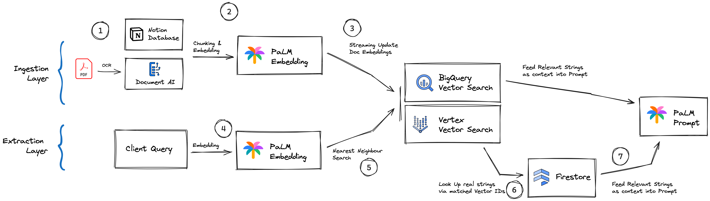

# Retrieval Augmented QA & Agent

This is an implementation of the Retrieval Augmented Generation (RAG) pattern to power a Q&A across mutliple knowledge management platforms.

On top we are building (wip) an Retrieval Augmented Agent that is able to take actions instructured by natural language in the underlying knowledge base.

At this point we developed integrations to connect a bucket of PDFs and a Notion DB as knowledge base to answer questions and take actions.

Expected behaviour will be that the model responds to questions and takes actions exclusively based on the data contained in the knowledge base.

## Solution Demo

The Streamlit UI allows adding and deleting PDF files to and from the knowlegdge base. To connect a Notion DB enter the respective Database ID.

Once your knowledgebase is connected succesfully select an LLM and enter a query.

## Architecture RAG Q&A
The full tooling is using Google Cloud Platform (GCP) native technology.

* Document OCR: [Document AI](https://cloud.google.com/document-ai/docs/overview)
* Generation of Content & User Query embeddings: [PaLM Embedding Model](https://cloud.google.com/vertex-ai/docs/generative-ai/embeddings/get-text-embeddings)
* Storing and making vector embeddings searchable: [Vertex Vector Search](https://cloud.google.com/vertex-ai/docs/vector-search/overview)
* Ledger connecting embeddings to original content strings: [Firestore](https://firebase.google.com/docs/firestore)
* generating a conversational response to the users original question based on the content identified as relevant: [PaLM text model](https://cloud.google.com/vertex-ai/docs/generative-ai/text/test-text-prompts)

